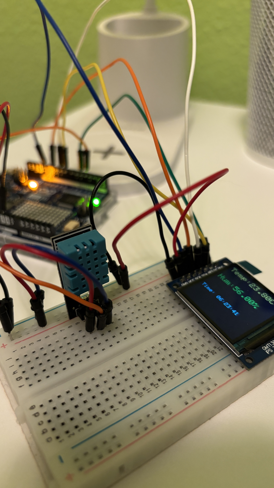
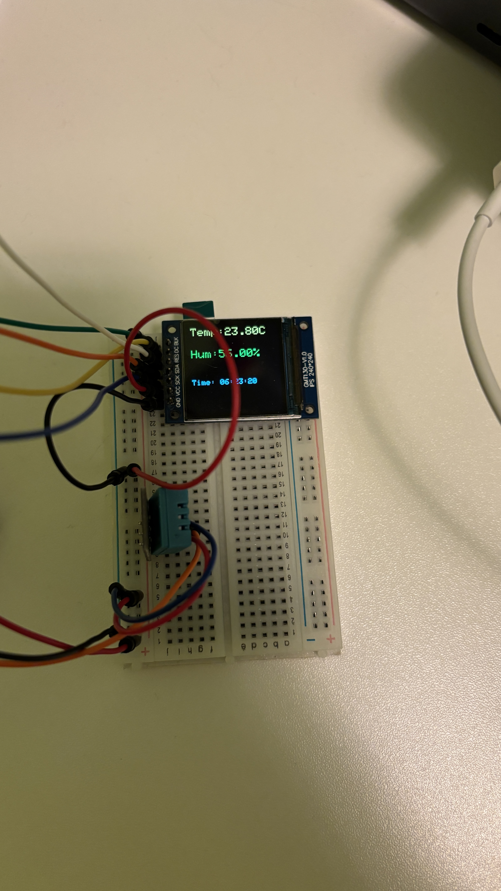
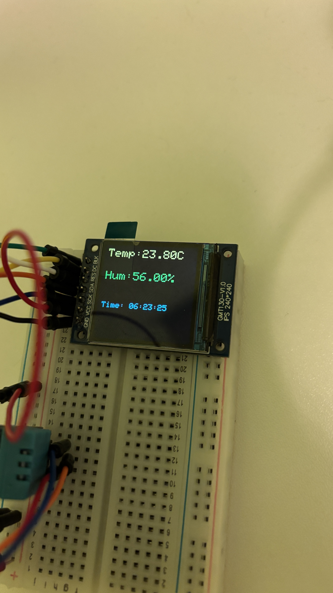
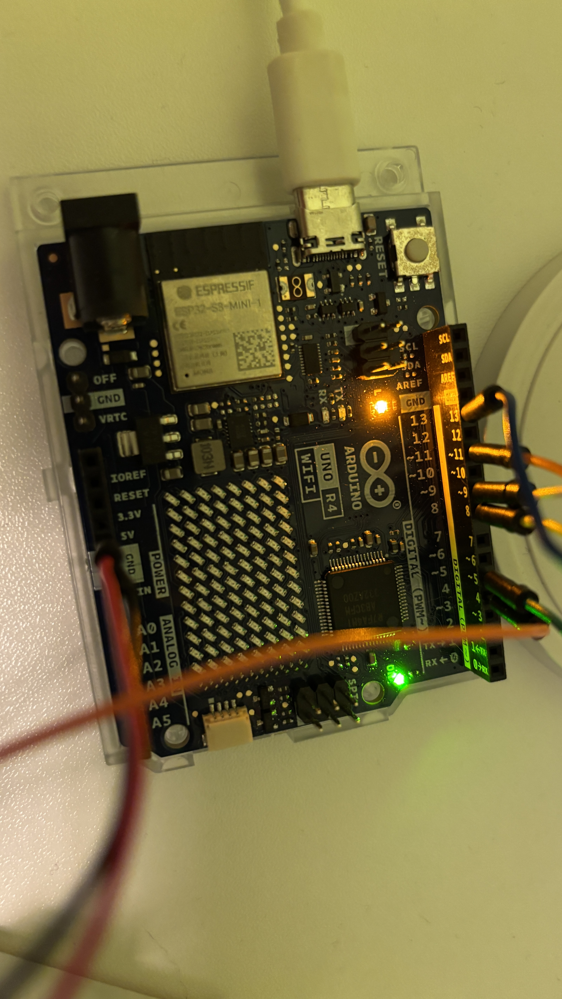
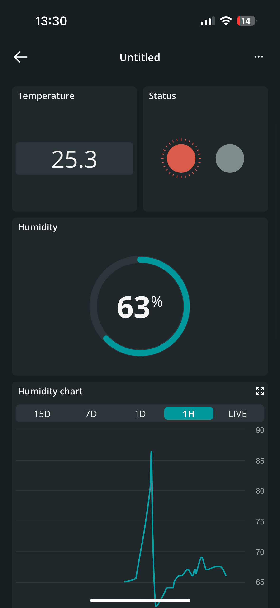
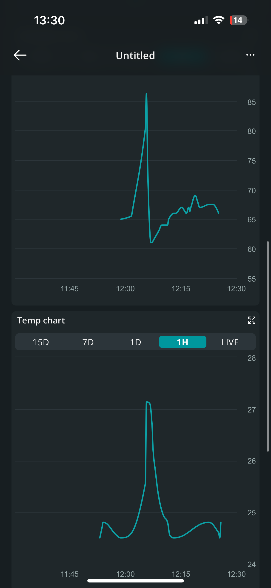
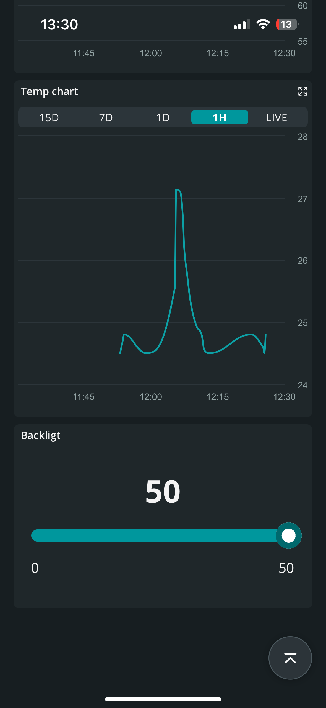

# IoT beadandóra készített projekt

### Tagok
Fekete Miklós,
Varga Péter,
Erős József

### Alkatrészek

1. Arduino Uno R4 Wifi
2. DHT11 Hömérséklet és pára szenzor
3. GMT 130 240x240 TFT kijelző
4. Breadboard
5. Jumper kábelek

A projekt rendkívül egyszerű. 5 máspdpercenként mintát veszünk a DHT11 szenzor adataiból és kiíratjuk a kijelzőre.

Ezzel egyidőben a pool.ntp.org kiszolgálóról beállítjuk a pontos időt, amit úgyszintén kiíratunk a kijelzőre.

A szenzor adatait felküldjük a felhőbe is, (Arduino IoT Cloud) Ahol a megfelelő változók létrehozása után egyedi dashboardon megjelenítjük a mért adatokat, ezekből chartot kreálunk, valamint a kijelző fényerejét is állíthatjuk a csúszka segítségével.

